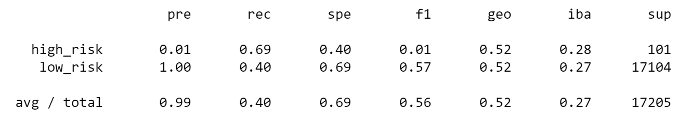

# Credit_Risk_Analysis

## Purpose

Predicting the risk of lending money through credit cards can be a tricky value to numerically uncover. Credit risk is an inherently unbalanced classification problem as typically the amount of good loans easily outnumber the risky loans. However, though good loans outnumber bad loans the risk is still high; just a few loans in large amounts that do not get paid back can significantly impact a credit company. To tackle a complex, multifaceted problem such as this, data analysts turn to machine learning. 

In this analysis, a credit card dataset from LendingClub, a peer-to-peer lending services company, will be oversampled and undersampled and ran through six different machine learning models. This will allow different models to be compared to find the best fit (highest accuracy) for predicting trends using this dataset as a training model. Using a combinatorial approach of under- and oversampling will offset the unbalanced representation of bad loans in the dataset and help to train a model that will accurately predict future loans, helping credit companies determine which loans are risky before the money is lent.

## Analysis and Results

Before the data could be trained on a machine learning model, the data needed to be preprocessed. All null values were dropped, all columns were converted to numerical values, and the target column (risk) was separated and converted into two columns, one for low risk and one for high risk. The data was separated into features and the target and then split into training and testing datasets using *sklearn*.

First we will discuss the oversampling methods. The purpose of oversampling is to duplicate or create new synthetic examples in the minority classs. This will allow data that is underepresented in the set to be more represented and can offset bias in the data. This is important for this credit risk anaylsis because bad loans are a small population of the data but are what is most important to predict.

For this analysis, the *RandomOverSampler* from the *imblearn* library was imported and used to resample the training and testing data. The resampled data was trained on the logistic regression model and the balanced accuracy score, confusion matrix, and classfication report were generated using the *imbalanced_classification_report* from *imbalanced-learn*. A random state of 1 was used for each model to ensure consistency.

 
 *Figure 1: The classification report for the random oversampler model*

The balanced accuracy score was generated and found to be: 0.6438627638488825. The precision for this model is high but due to the recall, f1 score, and the balanced accuracy being low (farther from the ideal value of 1.0) this model is not looking like a good fit for our data. The measures are above 50% so it is not a terrible fit but given that is the first model tested out of six, hopefully one of the other models will generate higher scores.

The next model tested was the *SMOTE: Synthetic Minority Over-sampling Technique* from the *imblearn* library. This is again a Logistic Regression model, the balanced accuracy score for this model is: 0.6628910844779521. Already higher than the *RandomOverSampler*!

*Figure 2: The classification report for the SMOTE oversample model*

The f1 score for this model is 0.81 which is higher than the score for the *RandomOverSampler* model. The recall values is also higher but the recall is still only 0.69, not a bad score but something that might be improved upon in a different model. Out of the oversampling models tested, the *SMOTE* model is the better fit for our data. 

The next method tested is an undersampling technique, the *Cluster Centroids* algorithm from the *imblearn* library is used in this analysis. The purpose of undersampling is to delete or merge examples in the majority class. This will again help to reduce bias in the dataset and potentially increase the precision of the model to accurately predict risky credit loans.

*Figure 3: The classification report for the Cluster Centroid undersampling algorithm*

The balanced accuracy score for this model is: 0.5442661782548694. The lowest score yet! Already the undersampling technique is not looking like the best option for this dataset. The f1 score and recall value are also the lowest so far at 0.56 and 0.40, respectively. Just comparing these first three models it seems that oversampling is a better technique than undersampling for our dataset. Undersampling works better when utilized with metadata, very large datasets, and could be redundant for this dataset and not actually helping to reduce the bias.

## Summary
